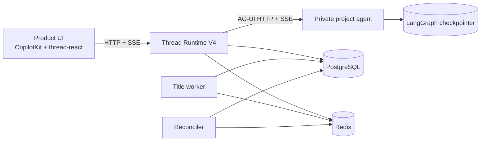
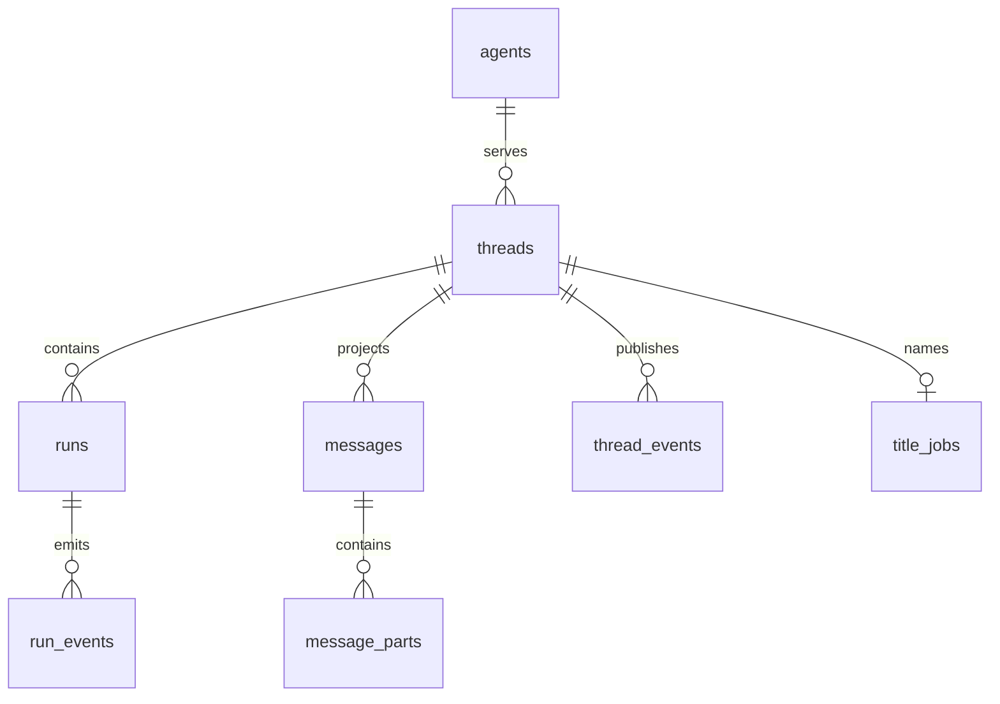
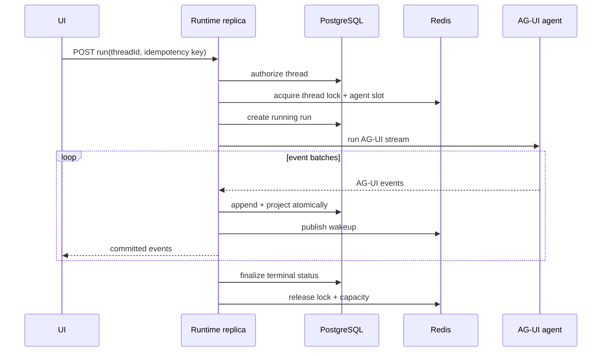

# Thread Platform V4 Architecture

## 1. Purpose

Thread Platform V4 is a self-hosted, framework-neutral conversation service for
CopilotKit and AG-UI agents, with LangGraph as the reference integration. It
stores durable thread metadata, canonical message history, active-run events,
and realtime sidebar changes without CopilotKit Enterprise or LangGraph Agent
Server.

The platform is a modular monolith. PostgreSQL is the durable source of truth.
Redis coordinates locks, cancellation, capacity, rate limits, and wakeups, but
is never the only copy of conversation data.

## 2. System context



The same UUID is used as the UI thread ID, CopilotKit thread ID, AG-UI
`threadId`, and LangGraph `configurable.thread_id`.

## 3. Ownership boundaries

| Module | Responsibility |
| --- | --- |
| Identity | Gateway/JWT authentication and immutable request principal |
| Agents | Agent registry, endpoint policy, credentials, health and capacity |
| Threads | Thread lifecycle, ownership, pagination and sidebar events |
| Runs | Idempotency, distributed locking, cancellation and terminal status |
| Events | AG-UI validation, durable append, projection and replay |
| Titles | Transactional title-job outbox and asynchronous generation |
| Maintenance | Stale-run reconciliation, retention, purge and metrics |
| Infrastructure | PostgreSQL, Redis, HTTP, clocks, IDs and external agents |

Domain and repository methods receive an explicit principal/scope. Ambient
request context is permitted only at the CopilotKit `AgentRunner` boundary,
where it is captured immediately and passed into application services.

## 4. Data architecture

V4 owns the PostgreSQL schema `thread_platform`:



### Invariants

- Every user-facing query is scoped by namespace, tenant ID, and owner ID.
- A partial unique index allows at most one queued/running run per thread.
- Redis locks use an ownership token; release and heartbeat are compare-and-set.
- A run has a client idempotency key, heartbeat timestamp, fencing token, and
  exactly one terminal status.
- Raw AG-UI events and their canonical message projection commit in one
  PostgreSQL transaction.
- Completed history replays from messages, parts, and latest snapshots. Active
  history replays from raw run events.
- Soft deletion is immediate to callers; physical deletion is retention based.
- LangGraph checkpoint tables remain owned by the agent/checkpointer package.

## 5. Realtime model

Browser realtime transport is SSE, not WebSocket:

- CopilotKit run/connect responses stream AG-UI events over SSE.
- `/v4/thread-events` streams sidebar mutations over SSE with `Last-Event-ID`.
- Mutations and cancellation remain ordinary HTTP requests.

Redis Pub/Sub carries only wakeups. A subscriber first reads PostgreSQL through
its cursor, subscribes, and reads PostgreSQL again to close the subscribe race.
Every wakeup triggers another cursor read. Periodic catch-up and reconnect make
lost Pub/Sub messages harmless. Redis Streams are not used as a second event
database.

## 6. Run lifecycle



Malformed agent lifecycles become `AGENT_PROTOCOL_ERROR`. Terminal, tool,
interrupt, and snapshot boundaries flush immediately; text chunks may be
batched by time, count, and bytes.

Stop requests publish a cancellation signal so the replica that owns the
upstream subscription can abort it. Graceful shutdown drains, then marks
unfinished runs interrupted. After an ungraceful process loss, the reconciler
detects an expired lock plus stale heartbeat, closes streaming projections,
and finalizes the run as interrupted. V4 preserves partial output and supports
an idempotent retry; it does not promise transparent continuation after a
process crash.

## 7. Public interfaces

The Thread API base path is `/v4`:

- `POST /threads` with `Idempotency-Key`
- `GET /threads`
- `GET /threads/{threadId}`
- `GET /threads/{threadId}/messages`
- `PATCH /threads/{threadId}` with `If-Match`
- `POST /threads/{threadId}/archive` with `If-Match`
- `POST /threads/{threadId}/unarchive` with `If-Match`
- `DELETE /threads/{threadId}` with `If-Match`
- `GET /thread-events`
- `/admin/agents` for registry administration
- `/api/copilotkit` for CopilotKit multi-route runtime traffic

Errors use one envelope:

```json
{
  "error": {
    "code": "THREAD_BUSY",
    "message": "Thread already has an active run",
    "requestId": "018f..."
  }
}
```

The runtime uses `createCopilotRuntimeHandler`, the fetch-native CopilotKit
surface. The existing Express host delegates Node requests through CopilotKit's
fetch-native adapter, so it does not implement or re-expose LangGraph routes and
does not buffer SSE responses.

## 8. Security model

- Development identity mode is rejected outside explicit local deployments.
- Gateway mode accepts identity headers only with a constant-time verified
  shared secret; the gateway must strip client-provided identity and secret
  headers before injecting canonical values.
- JWT mode validates signature, issuer, audience, tenant, subject, and roles.
- CORS origins are exact; the agent, Redis, and PostgreSQL remain private.
- Every run, connect, stop, history, and mutation repeats ownership checks.
- Agent URLs are allowlisted and credentials are stored only as environment or
  mounted-file references.
- Metadata is display/routing context and never an authorization source.

## 9. Failure behavior

| Failure | Expected result |
| --- | --- |
| Redis restart/flush | Durable history remains; locks expire and stale runs reconcile |
| PostgreSQL unavailable | New events are not shown as committed; run aborts with storage error |
| Runtime replica dies | Partial committed output replays; run becomes interrupted |
| Agent disconnects | Run fails once with a normalized transport error |
| Duplicate submit | Same idempotency key returns the original result; a different key gets `THREAD_BUSY` |
| Lost Pub/Sub wakeup | Subscriber catches up from PostgreSQL cursor |
| Duplicate AG-UI event | Unique run sequence/idempotency rules suppress duplicate projection |
| Concurrent mutation | Stale `If-Match` receives `THREAD_VERSION_CONFLICT` |

## 10. Verification gates

- Fresh and repeated migrations succeed.
- Typecheck, unit tests, integration tests, package builds, Compose validation,
  and Helm lint pass from a frozen install.
- Two replicas enforce one active run per thread while allowing different
  threads to run concurrently.
- Cross-replica connect and stop work without sticky sessions.
- Redis loss does not remove completed history.
- Crash reconciliation produces one terminal interrupted result.
- Tenant and owner isolation is covered by integration tests.
- Text, tools, state, activity, and HITL events replay in protocol order.

## 11. Versioning and rollout

V4 is a breaking replacement because no production data is being retained.
Published JavaScript packages use major version `2.0.0`; the HTTP API uses
`/v4`. The V3 routes, schema migrations, Redis Stream compatibility layer, and
legacy request-body idempotency contract have been removed.
