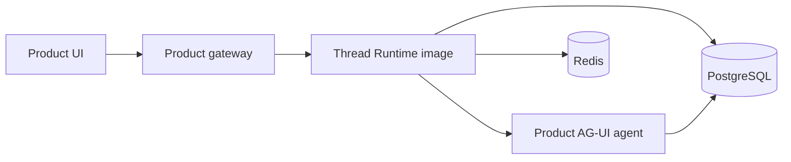

# Consumer Quickstart

This is the entry point when adding self-hosted threads to another project.
The product owns its agent and UI. This repository supplies a separately
deployed Runtime plus small browser SDKs.

## 1. Choose a topology

Recommended production topology:



The gateway authenticates users and routes `/agent-platform/*` to Runtime. The
agent, PostgreSQL and Redis remain private. Runtime and the product may share a
PostgreSQL server, but migrations and schemas remain independently owned.

## 2. Build the product agent

Expose `POST /agent` using AG-UI and `GET /health`. Compile LangGraph with a
durable checkpointer. Follow [Agent Contract](AGENT_CONTRACT.md), then test it:

```bash
pnpm dlx @kiri_ikki/thread-agent-check \
  --agent-url http://localhost:8000/agent \
  --health-url http://localhost:8000/health \
  --concurrency 2
```

The CLI rejects malformed run/text/tool lifecycles, including the event-order
bugs that CopilotKit reports as `TEXT_MESSAGE_START`, `CONTENT`, or late
`CUSTOM` errors.

## 3. Run the core locally

Copy `docker-compose.yml` and the core service environment from this repository,
or start from `examples/consumer-starter/compose.yaml`. Pin an immutable version:

```yaml
services:
  runtime:
    image: ghcr.io/hieuej147/copilotkit-threads-runtime:0.1.1
    environment:
      POSTGRES_URL: postgresql://...
      REDIS_URL: redis://...
      AGENT_URL: http://agent:8000/agent
      AGENT_NAMESPACE: my-product
      AGENT_ID: support
      AUTH_MODE: development # local only
```

Run the same image once with
`node apps/runtime/dist/migrate.js`, continuously with
`node apps/runtime/dist/title-worker-main.js`, normally for Runtime, and on a
five-minute schedule with `node apps/runtime/dist/reconcile-main.js`. One
PostgreSQL database is sufficient: core tables live in `agent_core`; LangGraph
owns its checkpoint tables.

Validate the running Thread API:

```bash
pnpm dlx @kiri_ikki/thread-agent-check --runtime-url http://localhost:4000
```

## 4. Integrate the UI

```bash
pnpm add @kiri_ikki/thread-react @copilotkit/react-core
```

```tsx
import { CopilotChat, CopilotKit } from "@copilotkit/react-core/v2";
import { ThreadClient, useThreadManager } from "@kiri_ikki/thread-react";

const client = new ThreadClient({
  baseUrl: "/agent-platform",
  credentials: "include",
});

export function AgentWorkspace() {
  const manager = useThreadManager({ client, agentId: "support", pageSize: 30 });
  const threadId = manager.selectedThreadId;
  // Use a draft composer here. On first submit, create the thread, mount the
  // keyed CopilotKit tree, and dispatch that pending message once.
  if (!threadId) return <DraftComposer onFirstSubmit={startThreadAndSend} />;

  return (
    <CopilotKit
      key={threadId}
      runtimeUrl="/agent-platform/api/copilotkit"
      useSingleEndpoint={false}
      agent="support"
      threadId={threadId}
    >
      <CopilotChat key={threadId} agentId="support" threadId={threadId} />
    </CopilotKit>
  );
}
```

Keep `ThreadClient` stable. Use `manager.fetchMore()` at the sidebar scroll
sentinel. Key `CopilotKit` by `threadId`; Runtime reconnect supplies history to
CopilotChat, so the product must not reconstruct chat messages manually. The
reference implementation of `startThreadAndSend` is
`examples/nextjs-copilotkit/components/threaded-app.tsx`; it prevents empty rows
and duplicate first-message dispatches.

## 5. Production configuration

- Use `AUTH_MODE=gateway` behind an authenticated gateway, or validated JWT.
- Set `AGENT_ALLOWED_HOSTS` to exact private agent hosts (or narrowly scoped
  wildcard suffixes); Runtime refuses production startup without an allowlist.
- Use a unique `AGENT_NAMESPACE` per product/environment.
- Pin the Runtime image to a release, never `latest`.
- Run migrations as a deployment job before Runtime rolls out.
- Run at least two Runtime replicas; Redis coordinates one active run per
  thread while different threads run concurrently.
- Put product relations in product tables as UUID references. Do not add core
  tables to Prisma's migration ownership.
- Configure exact CORS origins, TLS, managed PostgreSQL backups and monitoring.
- Choose `DELETED_THREAD_RETENTION_DAYS` explicitly. Delete is hidden
  immediately and physically purged by the reconciler after that window. When
  the agent uses an external checkpoint or memory store, purge the same thread
  ID there from the product's deletion workflow.

See [Thread Platform Handbook](THREAD_SERVICE_GUIDE.md) for all environment
variables, SQL inspection, Helm deployment and operational failure modes.
