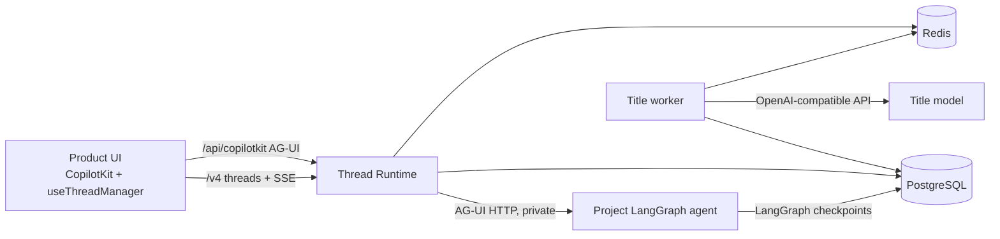

# Thread Platform Handbook

This is the canonical guide for operating this repository and integrating it
with another product. The `examples/` directory is disposable reference code;
the reusable product is Runtime, PostgreSQL migrations, SDKs and Helm chart.

## 1. Architecture



One Runtime deployment serves one `AGENT_NAMESPACE` and multiple agent IDs from
the PostgreSQL-backed registry. Deploy separate installations for different
projects/environments.
The UUID `threadId` is identical in the UI, CopilotKit Runtime, AG-UI request and
LangGraph `configurable.thread_id`.

Responsibilities:

| Component | Owns |
|---|---|
| Runtime | authentication context, thread API, CopilotKit endpoint, run persistence, AG-UI lifecycle normalization |
| PostgreSQL | threads, messages, runs, replay events, title jobs, LangGraph checkpoints |
| Redis | per-thread run lock, cancellation, short-lived run stream, SSE wake-up and rate-limit counters |
| Project agent | graph, prompts, business tools, interrupts and checkpoint state |
| Product UI | CopilotKit chat and product-specific thread presentation |

The title model never participates in the main agent stream. The first user
message creates exactly one PostgreSQL outbox job in the same transaction as run
creation. A separate worker claims jobs using `FOR UPDATE SKIP LOCKED`. Manual
rename closes that job, so later messages never regenerate the title.

## 2. Database ownership

Use one PostgreSQL server/database if desired, but keep ownership boundaries:

- `thread_platform.*`: owned and migrated by Runtime from `infra/postgres/`.
- LangGraph checkpoint tables: owned by `langgraph-checkpoint-postgres`.
- Product tables: owned by Prisma, Drizzle or the product's migration tool.

Do not model or migrate `thread_platform` or LangGraph tables in Prisma. Reference a
thread from product data with a scalar UUID and optional database foreign key:

```prisma
model SupportTicket {
  id            String  @id @default(uuid()) @db.Uuid
  agentThreadId String? @unique @map("agent_thread_id") @db.Uuid
}
```

For a shared database, add the foreign key in a product-owned SQL migration only
if both services share lifecycle and deployment ownership:

```sql
ALTER TABLE public.support_tickets
  ADD CONSTRAINT support_ticket_thread_fk
  FOREIGN KEY (agent_thread_id)
  REFERENCES thread_platform.threads(id)
  ON DELETE SET NULL;
```

For microservices or separate databases, never use a cross-service foreign key.
Store the UUID plus tenant/user ownership, call the Thread API, and handle
`404 THREAD_NOT_FOUND` as a normal stale-reference case.

At creation time, attach small non-authoritative product context (maximum 16 KiB)
without coupling schemas:

```ts
await manager.createThread({
  idempotencyKey: crypto.randomUUID(),
  metadata: { entityType: "support_ticket", entityId: ticket.id },
});
```

Keep authoritative relations and permissions in the product database; thread
metadata is for routing/display context, not authorization.

## 3. Integration options

### Option A: deploy as a separate service (recommended)

1. Build/publish `apps/runtime/Dockerfile`.
2. Apply the Helm chart or core Compose file.
3. Set `agent.url` to the project's private AG-UI LangGraph endpoint.
4. Expose `/api/copilotkit`, `/v4/threads` and `/v4/thread-events` through the
   product gateway.
5. Give the browser only the gateway URL, never PostgreSQL/Redis/agent URLs.

This keeps Prisma and product releases independent of thread infrastructure.

### Option B: consume published UI packages

Install these packages from npm; do not copy Runtime source into the product:

```text
@kiri_ikki/thread-contracts
@kiri_ikki/thread-client
@kiri_ikki/thread-react
```

The server still runs independently. These packages provide contracts and UI
state; they do not open a database connection.

## 4. Product UI

Create one stable client instance and use the provided hook for cursor pagination
and SSE updates:

```tsx
import { CopilotKit } from "@copilotkit/react-core/v2";
import { ThreadClient, useThreadManager } from "@kiri_ikki/thread-react";

const client = new ThreadClient({
  baseUrl: "/agent-platform",
  credentials: "include",
  // JWT mode: getAccessToken: () => auth.getAccessToken(),
});

export function AgentWorkspace() {
  const threads = useThreadManager({ client, agentId: "support", pageSize: 30 });
  const threadId = threads.selectedThreadId;

  // When threadId is null, render a draft composer. On its first submit,
  // await threads.createThread(), mount CopilotKit, then dispatch that message.
  if (!threadId) return <DraftComposer onFirstSubmit={startThreadAndSend} />;
  return (
    <CopilotKit
      key={threadId}
      runtimeUrl="/agent-platform/api/copilotkit"
      agent="support"
      threadId={threadId}
      useSingleEndpoint={false}
    >
      {/* Render CopilotChat and your sidebar here. */}
    </CopilotKit>
  );
}
```

Important rules:

- Keep `ThreadClient` outside the React component or memoize it.
- Key `CopilotKit` by `threadId`; this gives each thread isolated chat state.
- Use CopilotKit's `CopilotChat`, `useRenderToolCall`/tool renderer and interrupt
  hook for chat behavior. Use `useThreadManager` only for sidebar metadata.
- Do not merge message history manually into CopilotChat. Runtime `connect()`
  replays persisted AG-UI events when a thread is selected.
- Do not create an empty thread just because the chat route mounted. Present a
  draft composer and create it idempotently only when the first message is sent.
- `fetchMore()` performs keyset pagination. The hook subscribes from the event
  cursor returned with the initial snapshot, so mounting does not replay all old
  sidebar events.

See `examples/nextjs-copilotkit/` for tool and HITL renderers.

## 5. Project LangGraph agent

The external agent must expose an AG-UI compatible endpoint. With Python:

```python
from ag_ui_langgraph import LangGraphAgent
from fastapi import FastAPI, Request
from fastapi.responses import StreamingResponse

app = FastAPI()
agent = LangGraphAgent(name="support", graph=compiled_graph)

@app.post("/agent")
async def run_agent(request: Request):
    return StreamingResponse(
        agent.run(await request.json()),
        media_type="text/event-stream",
    )
```

Compile the graph with `AsyncPostgresSaver` and use the incoming thread ID as
LangGraph `configurable.thread_id`. Run checkpoint migrations as a separate
deployment job. Business tools and `interrupt()` remain inside this service.
`examples/langgraph-agent/` is the executable reference.

Runtime forwards the authenticated principal in reserved input metadata:

```json
{"forwardedProps":{"threadPlatform":{"tenantId":"acme","userId":"u-42","roles":["agent-user"]}}}
```

Treat that metadata as context, not as a replacement for private-network service
authentication between Runtime and agent.

## 6. HTTP API

The only Thread API base path is `/v4`; `/v2` returns 404. CopilotKit package
imports ending in `/v2` are unrelated to this HTTP API and must not be changed.
Full schemas are in `docs/openapi.yaml`.

| Method | Path | Purpose |
|---|---|---|
| POST | `/threads` | idempotent create using the `Idempotency-Key` header |
| GET | `/threads?limit=30&cursor=...` | keyset/lazy list |
| GET | `/threads/{id}` | thread metadata |
| GET | `/threads/{id}/messages?after=0` | projected messages for audit/export |
| PATCH | `/threads/{id}` | manual title rename |
| POST | `/threads/{id}/archive` | archive |
| POST | `/threads/{id}/unarchive` | restore |
| DELETE | `/threads/{id}` | soft delete, then retention-based physical purge |
| GET | `/thread-events` | authenticated SSE with `Last-Event-ID` replay |

Archive and delete are intentionally different. Archive sets `status='archived'`
and is reversible through `/unarchive`; the maintainer UI's box icon performs
this action. Delete sets `status='deleted'`, has no public restore endpoint and
enters the physical-purge lifecycle described in section 11.

One run is allowed per thread. Different threads can run concurrently, including
multiple threads owned by the same user. A second run on the same thread ends its
AG-UI stream with `RUN_ERROR: THREAD_BUSY`; exceeding an agent's configured
capacity returns `RUN_ERROR: AGENT_CAPACITY_EXCEEDED`. Scale Runtime horizontally;
Redis coordinates both controls.

Agent registry management is restricted to principals with the
`thread-platform-admin` role. Use `GET/PUT /v4/admin/agents`, disable instead of
deleting historical agents, and test connectivity through
`POST /v4/admin/agents/{agentId}/test`. The same operations are available from
`node apps/runtime/dist/agent-admin-cli.js agents ...`. Store only `env:` or
`file:` credential references and allowlist every agent host.

## 7. Authentication and isolation

Never expose `AUTH_MODE=development` outside local development.

Gateway mode (recommended when the product already has auth):

```env
AUTH_MODE=gateway
AUTH_TENANT_HEADER=x-auth-tenant-id
AUTH_USER_HEADER=x-auth-user-id
AUTH_ROLES_HEADER=x-auth-roles
AUTH_GATEWAY_SECRET_HEADER=x-thread-platform-gateway-secret
AUTH_GATEWAY_SECRET=<at-least-32-random-characters>
```

The trusted gateway validates the session/JWT, removes inbound spoofed identity
and gateway-secret headers, then injects canonical values plus the shared
secret. Runtime compares that secret in constant time before accepting identity
headers and scopes every thread query by
`tenant_id + owner_id + namespace`.

Direct JWT mode:

```env
AUTH_MODE=jwt
JWT_ISSUER=https://identity.example.com/
JWT_AUDIENCE=thread-platform
JWT_JWKS_URL=https://identity.example.com/.well-known/jwks.json
JWT_TENANT_CLAIM=tenant_id
JWT_USER_CLAIM=sub
JWT_ROLES_CLAIM=roles
```

Runtime validates signature, issuer and audience using remote JWKS. Configure
CORS to exact product origins and keep the agent, PostgreSQL and Redis private.

## 8. Local operation

Full reference stack:

```bash
cp .env.example .env
make demo-up
docker compose -f docker-compose.yml -f docker-compose.example.yml ps
docker compose -f docker-compose.yml -f docker-compose.example.yml logs -f runtime agent title-worker web
# Only recent logs (avoids confusing errors from replaced containers):
docker compose -f docker-compose.yml -f docker-compose.example.yml logs --since=5m runtime agent
```

Core with an external local agent:

```bash
AGENT_URL=http://host.docker.internal:8000/agent docker compose up -d
```

Inspect PostgreSQL:

```bash
docker compose exec postgres psql -U agent -d threads
```

```sql
SELECT id, tenant_id, owner_id, title, title_status, status, message_count,
       last_activity_at
FROM thread_platform.threads
ORDER BY last_activity_at DESC LIMIT 30;

SELECT thread_id, sequence, role, status, left(content::text, 120)
FROM thread_platform.messages ORDER BY created_at DESC LIMIT 50;

SELECT message_id, part_index, part_type, status, left(content::text, 160)
FROM thread_platform.message_parts ORDER BY created_at DESC LIMIT 100;

SELECT agent_id, endpoint_url, enabled, timeout_ms, max_concurrent_runs, version
FROM thread_platform.agents ORDER BY agent_id;

SELECT thread_id, status, attempts, last_error, updated_at
FROM thread_platform.title_jobs ORDER BY created_at DESC LIMIT 30;

SELECT id, event_type, thread_id, created_at
FROM thread_platform.thread_events ORDER BY id DESC LIMIT 50;
```

## 9. Kubernetes

The chart enforces migration ordering in two places:

- On install, Runtime and title-worker pods run the idempotent `thread_platform`
  migrator as an init container. The example LangGraph agent does the same for
  checkpoint tables. Application containers cannot become ready first.
- On upgrade, Helm runs the same migration jobs as `pre-upgrade` hooks before
  rolling deployments. PostgreSQL advisory locking makes concurrent Runtime
  init containers safe.

Deployment pod templates include a ConfigMap checksum. A Helm configuration
change therefore triggers a rollout automatically; do not rely on old pods
eventually re-reading environment variables.

Local k3d example:

```bash
export OPENAI_API_KEY=...
make local-up
make local-status
make local-logs
make local-db
```

Open `http://threads.localhost:8080`. Delete with `make local-down`.

Production uses core only (`examples.enabled=false`):

```bash
helm upgrade --install threads infra/k8s/charts/thread-platform \
  -n threads --create-namespace \
  -f infra/k8s/charts/thread-platform/values-production.example.yaml \
  --wait --timeout 10m
```

Create secrets before install:

```bash
kubectl -n threads create secret generic ticketing-postgres \
  --from-literal=postgres-url='postgresql://...'
kubectl -n threads create secret generic ticketing-redis \
  --from-literal=redis-url='rediss://...'
kubectl -n threads create secret generic ticketing-title-model \
  --from-literal=TITLE_API_KEY='...'
kubectl -n threads create secret generic ticketing-runtime \
  --from-literal=AUTH_GATEWAY_SECRET='...at-least-32-random-characters...'
```

Useful commands:

```bash
kubectl -n threads get deploy,pod,job,cronjob,ingress
kubectl -n threads logs deploy/threads-thread-platform-runtime -f --tail=200
kubectl -n threads logs deploy/threads-thread-platform-title-worker -f --tail=200
kubectl -n threads logs job/threads-thread-platform-postgres-migrate
kubectl -n threads describe pod <pod>
kubectl -n threads get events --sort-by=.lastTimestamp
```

Health probe access logs every few seconds are expected Kubernetes traffic. They
should be excluded or sampled in the agent's access logger, as the reference
agent does; they are not React requests or user runs.

## 10. Small production profile

The supplied defaults target approximately 100 active users and 25 concurrent
runs, subject to model latency and event volume:

- Runtime: 2 replicas, 100m CPU/256Mi request, 1 CPU/1Gi limit.
- Title worker: 1 replica. Increase replicas only if title-job lag grows.
- Managed PostgreSQL with automated backups and connection limits appropriate
  for all Runtime, worker and agent replicas.
- Redis with `noeviction`; persistence is optional because it is not history.
- Ingress buffering disabled and read timeout at least 3600 seconds for SSE.
- PodDisruptionBudget, rolling updates and a 45-second termination grace period.

Before calling a deployment production-ready, provide externally:

- TLS, DNS, WAF/gateway auth, secret manager and image registry.
- Managed PostgreSQL HA, point-in-time recovery and a tested restore procedure.
- Redis HA if temporary run interruption during Redis loss is unacceptable.
- Metrics scraping and alerts for 5xx, latency, active runs, dead title jobs,
  oldest title job, PostgreSQL saturation and Redis memory.
- Load test with representative streaming response sizes and model latency.

## 11. Backup, retention and recovery

Back up the entire PostgreSQL database so `thread_platform` and LangGraph checkpoints
remain consistent. Test restore into an isolated database quarterly. Redis does
not need to be restored for history; active runs may be marked interrupted by the
reconciler after lock loss.

`RUN_EVENT_RETENTION_DAYS`, `THREAD_EVENT_RETENTION_DAYS`,
`TITLE_JOB_RETENTION_DAYS` and `MESSAGE_RETENTION_DAYS` control independent
retention windows. Completed history reconnects from canonical messages/parts; raw run
events are short-lived audit and active-run recovery data.

`DELETE /v4/threads/{id}` immediately hides a thread by setting
`status='deleted'` and `deleted_at`. The reconciler physically removes the core
thread, runs, messages and events after `DELETED_THREAD_RETENTION_DAYS` (30 by
default, 0 means the next reconciler run). In the bundled same-database topology
it also removes rows from LangGraph's `checkpoints`, `checkpoint_blobs` and
`checkpoint_writes` tables. If the product agent stores checkpoints or long-term
memory in another database, that agent owns an equivalent deletion workflow;
the Runtime cannot purge an external store.

The Helm chart schedules the reconciler as a CronJob. Docker Compose does not
provide a scheduler; invoke it from cron/systemd at least every five minutes:

```bash
docker compose --profile maintenance run --rm reconciler
```

## 12. Troubleshooting

`404 /api/copilotkit`: Runtime must use CopilotKit multi-route handler and the UI
must point exactly to `/api/copilotkit`.

`THREAD_BUSY`: another run owns the same thread lock. This is an AG-UI
`RUN_ERROR`, not an HTTP response status. Switch thread or stop/wait for the
current run.

AG-UI errors about text start/content/end or custom events after finish: verify
the project agent emits one valid lifecycle. Runtime also normalizes duplicate
message starts, orphan content, duplicate ends and drops events after
`RUN_FINISHED`.

`Response object has been garbage collected`: commonly caused by browser
disconnects during streaming in older CopilotKit/runtime combinations. Confirm
the pinned versions, graceful shutdown, and that UI changes `CopilotKit` key only
when changing thread. Historical occurrences in old container logs do not prove
the current container is failing; use `docker compose logs --since=5m runtime`.

Title remains `New conversation`: inspect `title_jobs`, title-worker logs,
`TITLE_API_KEY`, `TITLE_BASE_URL` and model name. Chat remains non-blocking even
when title generation fails; the job retries and then becomes `fallback`.

Sidebar re-renders repeatedly: create `ThreadClient` once, do not recreate hook
options on every render, and use the SDK version that consumes `eventCursor`
rather than subscribing from event zero.
